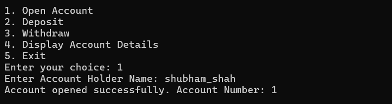
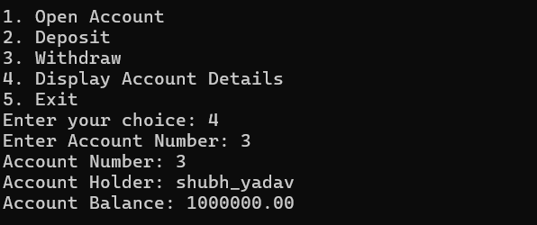
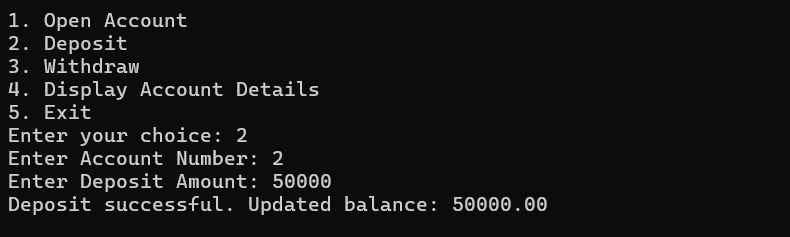
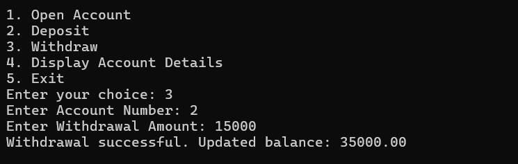

# Project-on-C
This Bank Management System is a first-semester C project designed to simulate basic banking operations. It allows users to create accounts, deposit and withdraw money, check balances, and manage records securely using file handling. The project highlights strong fundamentals in C programming, problem-solving, and structured coding practices.

# 🏦 Bank Management System in C

This project is a **Bank Management System** developed in C during my **first semester**.  
It simulates essential banking operations and demonstrates the use of **file handling, data structures, and modular programming** in C.  

---

## ✨ Features
- 📝 Create new bank accounts  
- 💰 Deposit and withdraw money  
- 🔍 Check account balance  
- 🔄 Transfer funds between accounts  
- 📂 Manage and update account records  

---

## 🚀 How to Run

1. **Clone this repository**:  
```bash
git clone https://github.com/thewebgenius/bank-management-system.git

cd bank-management-system

gcc bankms.c -o bankms.exe

./bankms

bankms.exe

```

## 📸 Project Output

### 🔹 Menu Screen


### 🔹 Account Creation


### 🔹 Deposit / Withdrawal



---

## 📄 Full Output PDF

For the complete collection of outputs, check the PDF below:  

👉 [View Project Output (PDF)](assets/Project_Output.pdf)

---

## 🛠️ Technologies Used
- C Programming Language  
- File Handling in C  


